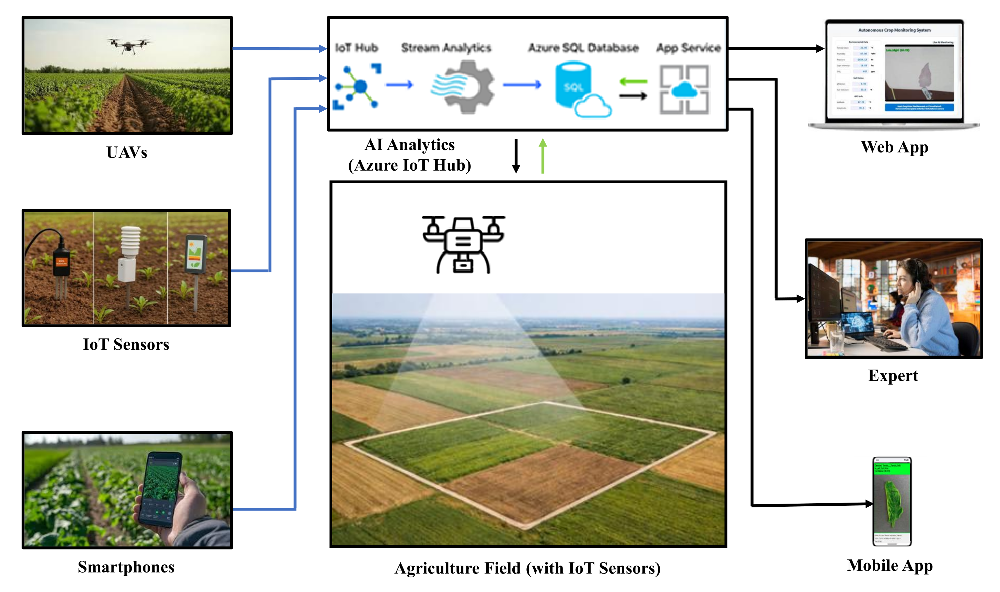

## Design and Evaluation of an AI-Enabled Cloud-Edge Architecture for Connected Precision Agriculture Farms

Abstract—Plant diseases cause significant yield losses world wide, with tomato crops particularly susceptible to early blight, late blight, and leaf mold. Manual monitoring is practical only for small-scale farms and becomes unmanageable at larger scales. To tackle this limitation, an artificial intelligence (AI) enabled cloud-edge architecture is proposed for autonomous crop monitoring. This proposed architecture integrates internet of things (IoT) sensors, unmanned aerial vehicles (UAVs), deep learning, Azure IoT Hub-based cloud analytics, and multiplatform (mobile app, web app, and embedded edge device platform) interfaces to enable real-time detection of tomato diseases. For training and validation, we used publicly available datasets, such as PlantVillage and Kaggle. A TensorFlow model trained on a collected dataset is deployed across mobile, web, and edge-device platforms. Experimental results show detection effectiveness around 92-95%, with consistent performance over diverse environments and device platforms. The proposed system improves disease detection effectiveness, lowers dependence on manual inspection, and enables prompt interventions, thereby supporting sustainable, connected precision agriculture farms.

Index Terms—Artificial Intelligence, Autonomous Crop Monitoring System, Deep Neural Networks, Plant Disease Detection, Precision Agriculture Farms, Unmanned Aerial Vehicles.

## Citation:
Angadi, D., Surga, K., G., Lakkaraju, N., Budda, N., Agarwal, V., Mulasa, G., V., R., R., Killamsetty, R., Mallubhotla, C., S., Kemsaram, N. (2026, August 13–14). Design and Evaluation of an AI-Enabled Cloud–Edge Architecture for Connected Precision Agriculture Farms. In Proceedings of the 2026 International Conference on Sustainable AI for Social Impact and Global Development (SASIGD 2026). IEEE.
